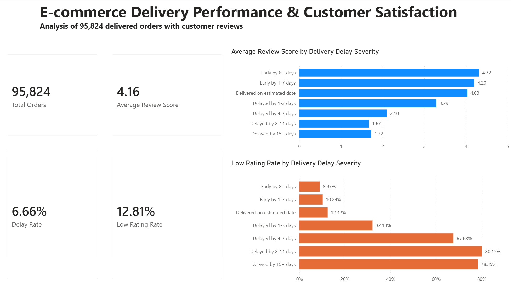
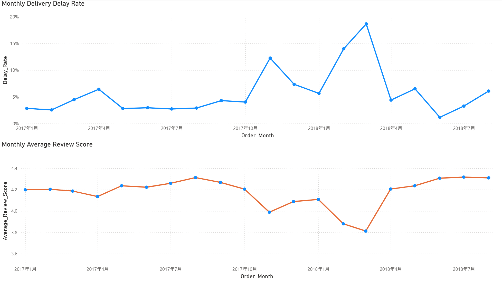

# E-commerce Delivery Delay and Customer Satisfaction

## Project Overview

This portfolio project investigates the relationship between delivery delays and customer satisfaction using the Brazilian E-Commerce Public Dataset by Olist.

The main research question is:

> How are delivery delays associated with customer review scores?

The project follows an end-to-end analytical workflow, including data auditing, SQL analysis, data preparation, statistical exploration and dashboard development. The results are intended to support business decisions related to delivery performance and customer experience.

## Key Findings

- The final analytical dataset contains **95,824 delivered orders with valid delivery dates and customer reviews**.
- **6.66%** of the orders in the analytical sample were delivered after the estimated delivery date.
- The overall average customer review score was **4.16 out of 5**.
- Orders delivered on time or early received an average review score of **4.29**, compared with **2.27** for delayed orders.
- The low-rating rate, defined as the percentage of one- or two-star reviews, was **9.27%** for on-time or early orders and **62.42%** for delayed orders.
- Customer satisfaction deteriorated nonlinearly as delays became more severe:

| Delivery group | Orders | Average review score | Low-rating rate |
|---|---:|---:|---:|
| Early by 8+ days | 70,929 | 4.32 | 8.97% |
| Early by 1–7 days | 17,234 | 4.20 | 10.24% |
| Delivered on estimated date | 1,280 | 4.03 | 12.42% |
| Delayed by 1–3 days | 1,852 | 3.29 | 32.13% |
| Delayed by 4–7 days | 1,748 | 2.10 | 67.68% |
| Delayed by 8–14 days | 1,446 | 1.67 | 80.15% |
| Delayed by 15+ days | 1,335 | 1.72 | 78.35% |

The most important operational implication is that businesses should prioritize preventing delays longer than three days, where customer satisfaction declines particularly sharply.

These findings describe associations in the available data and should not be interpreted as definitive causal effects.

## Dashboard

### Overview



The overview page presents the main business metrics and compares customer satisfaction across different levels of delivery delay.

### Time Trends



The time-trends page examines monthly delivery-delay rates and average review scores from January 2017 to August 2018. Sparse and incomplete observations from 2016 were excluded from the formal monthly comparison.

Periods with relatively high delivery-delay rates, particularly November 2017 and February–March 2018, also showed lower average review scores.

## Business Recommendations

1. Prioritize operational interventions that prevent delays from exceeding three days.
2. Monitor monthly delay rates and investigate periods with unusually high delivery delays.
3. Introduce early-warning procedures for orders at risk of missing their estimated delivery dates.
4. Evaluate the cost, feasibility and expected effectiveness of possible logistics interventions before allocating resources.
5. Use additional product, seller and geographic information in future analysis to identify the operational sources of delivery risk.

## Data Source

The project uses the [Brazilian E-Commerce Public Dataset by Olist](https://www.kaggle.com/datasets/olistbr/brazilian-ecommerce).

The dataset contains approximately 100,000 anonymized orders placed between 2016 and 2018. It includes information about orders, customers, products, sellers, payments, delivery dates and customer reviews.

Nine CSV files are used in the project:

- customers;
- geolocation;
- order items;
- order payments;
- order reviews;
- orders;
- products;
- sellers;
- product-category translations.

The original data files are not stored in this repository. They can be downloaded from the Kaggle source above.

## Analytical Definitions

### Delivery delay

```text
delay_days = actual customer delivery date - estimated delivery date
```

An order is classified as delayed when `delay_days > 0`.

### Low rating

A customer review is classified as a low rating when the review score is either one or two stars.

### Core analytical sample

The main analysis includes orders that:

- were marked as delivered;
- contained the required purchase, actual-delivery and estimated-delivery dates;
- had a valid customer review score;
- contained one selected review record per order.

Where an order had multiple review records, the most recently answered review was retained to create a one-order-per-row analytical dataset.

## Data-Quality Checks

The data-audit process included:

- checking the availability, size and structure of all source tables;
- identifying missing values;
- checking duplicated order and review identifiers;
- examining orders with multiple reviews;
- validating delivery-date logic;
- confirming one row per order in the final analytical dataset;
- reconciling order counts between the SQL, Python and Power BI outputs.

The original orders table contained no duplicated `order_id` values. The reviews table contained 547 orders with multiple review records, producing 551 additional review rows. These additional rows were resolved before the core dataset was created.

## Tools and Skills

- **Python and pandas:** data loading, auditing, cleaning and dataset construction;
- **DuckDB and SQL:** business-metric calculation and grouped analysis;
- **JupyterLab:** reproducible analysis and documentation;
- **Power BI:** KPI cards, delay-severity comparisons and monthly trend dashboards;
- **DAX:** calculated measures, display measures and ordered delivery-delay groups;
- **Git and GitHub:** version control and team collaboration;
- **Markdown:** project documentation and analytical communication.

## Repository Structure

```text
ecommerce-delivery-analysis/
├── data/
│   ├── raw/                         # Local source CSV files; not uploaded
│   └── processed/                   # Generated analytical data; not uploaded
├── images/
│   ├── dashboard_overview.png
│   └── dashboard_time_trends.png
├── notebooks/
│   ├── 00_environment_test.ipynb
│   ├── 01_data_audit.ipynb
│   ├── 02_statistical_audit.ipynb
│   ├── 03_sql_business_analysis.ipynb
│   ├── 04_core_dataset.ipynb
│   └── 05_delay_severity_analysis.ipynb
├── powerbi/
│   └── ecommerce_delivery_dashboard.pbix
├── report/
│   └── analysis_plan.md
├── sql/
│   └── 01_business_metrics.sql
├── team/
├── .gitignore
└── README.md
```

## Reproducing the Analysis

### 1. Clone the repository

```bash
git clone <repository-url>
cd ecommerce-delivery-analysis
```

### 2. Download the source data

Download the Olist dataset from Kaggle and place the nine CSV files in:

```text
data/raw/
```

### 3. Install the main Python packages

```bash
pip install pandas duckdb jupyterlab
```

### 4. Run the notebooks

Start JupyterLab from the repository and run the notebooks in numerical order:

```bash
jupyter lab
```

The main analytical dataset will be generated as:

```text
data/processed/core_analysis_orders.csv
```

### 5. Open the Power BI dashboard

Open:

```text
powerbi/ecommerce_delivery_dashboard.pbix
```

If the original local data path is unavailable, use Power BI's data-source settings to change the source to the newly generated `data/processed/core_analysis_orders.csv` file, and then refresh the dashboard.

## Team Contributions

### Economics and Business Analysis Lead

- project coordination;
- research-question design;
- SQL business analysis;
- core metric definitions;
- Power BI dashboard development;
- business interpretation and documentation.

### Mathematics and Statistical Analysis Contributor

- initial statistical and data-quality audit;
- duplicate and consistency checks;
- support for statistical methodology;
- review of analytical assumptions and results.

## Limitations

- The analysis is observational and does not establish causality.
- The final sample contains delivered orders with valid review and delivery information, so it does not represent cancelled, unavailable or unreviewed orders.
- Customer satisfaction may also be affected by product quality, seller performance, price, freight cost and other factors not yet controlled for.
- The monthly trend analysis begins in January 2017 because the available 2016 monthly observations were sparse.
- More evidence about intervention costs and operational feasibility would be required before making a formal resource-allocation decision.

## Possible Extensions

- statistical significance tests and effect-size estimation;
- regression analysis with additional control variables;
- product-category, seller and geographic delay analysis;
- investigation of high-delay months;
- prediction of orders at risk of late delivery;
- evaluation of alternative logistics interventions.